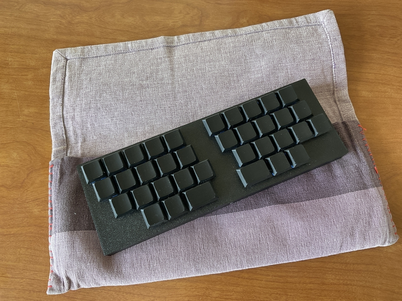
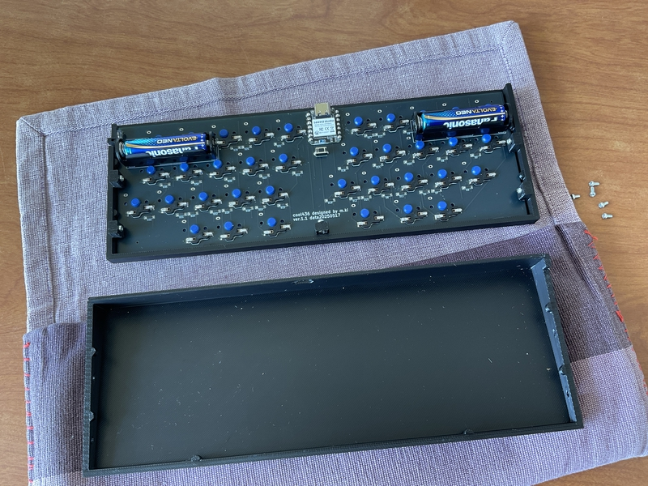

# cool436

## What is cool436?

cool436 is small keyboard.
 
cool436 use seeed xiao ble,run zmk_firmware.
 
 

## firmware

[zmk-config](https://github.com/telzo2000/zmk-config-cool436)

 
keymap editor

https://nickcoutsos.github.io/keymap-editor/

 
zmk studio

https://zmk.studio/

 

自作キーボードへのzmk_firmwareのインストールについて

https://sizu.me/m_ki/posts/kvixkn2mec6a

 
zmk_firmwareでのキーマップ編集について

https://sizu.me/m_ki/posts/m3devs7be5km

 

## buildguide

https://github.com/telzo2000/cool436/blob/main/buildguide_for_cool436.md

 

## BOM

<b>common parts</b>
| No. | Patrs | Quantity | remarks | Suppliers | Cost |
|--|--|--|--|--|--|
|番号|名前|数|備考|調達先|参考価格（送料込）| 
|1|PCB|1||[elecrow](https://www.elecrow.com) [JLCPCB](https://jlcpcb.com) [ALLPCB](https://www.allpcb.com)|| 
|2|Top case|1|3D Print|||
|3|Bottom case|1|3D Print|||
|4|Switch knob|1|3D Print|||
|5|Slide switch スライドスイッチ|1||[秋月電子](https://akizukidenshi.com/catalog/g/g115370/)|１個30円|
|6|AAAA Battery case 単４電池ケース|2||[秋月電子](https://akizukidenshi.com/catalog/g/g102670/)|１個40円|
|7|XIAO nRF52840|1|MCU Board|[seeed studio](https://jp.seeedstudio.com/Seeed-XIAO-BLE-nRF52840-p-5201.html?msclkid=5541f7f3d0f911eca6023fe520de5bfa) [秋月電子](https://akizukidenshi.com/catalog/g/g117341/)|1940円|
|8|Diode ダイオード|36|SMD|[遊舎工房](https://yushakobo.jp) [Talp Keyboard](https://talpkeyboard.net) [Daily Craft Keyboard](https://shop.dailycraft.jp)等|100個で220円程度から|
|9|Swith socket スイッチソケット|36|choc|[遊舎工房](https://yushakobo.jp) [Talp Keyboard](https://talpkeyboard.net) [Daily Craft Keyboard](https://shop.dailycraft.jp)等|10個で165円程度|
|10|Screw ネジ|5|黒色、スリムヘッドM2 4mm|[遊舎工房](https://shop.yushakobo.jp/products/a0800s2?variant=37665432535201)|50本880円(遊舎工房)|
|11|Screw ネジ|5|M2 3mm|DIY shop|10本200円程度|
|12|Spacer スペーサー|5|M2 3mm|DIY shop|10本400円程度|
|13|Keyswitch キースイッチ|36|chocV1及びV2対応|[遊舎工房](https://yushakobo.jp) [Talp Keyboard](https://talpkeyboard.net) [Daily Craft Keyboard](https://shop.dailycraft.jp)|１個100程度|
|14|Keycap キーキャップ|36|17.5mm以下の狭ピッチ、ロープロが最適|3D Print||

In addition, NiHM rechargeable batteries (4 AAA size), USB cable, etc. are required.
 
この他に、NiHM充電池（単４形４本）、USBケーブル等が必要です。
 

 

# license

[CC BY-NC-SA](https://creativecommons.org/licenses/by-nc-sa/4.0/deed.ja)

